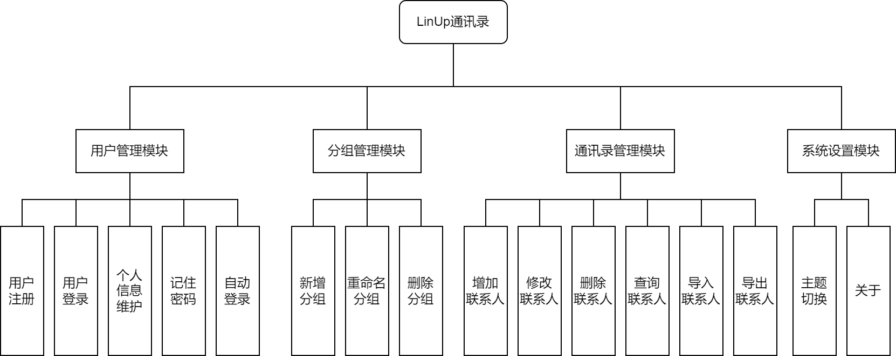
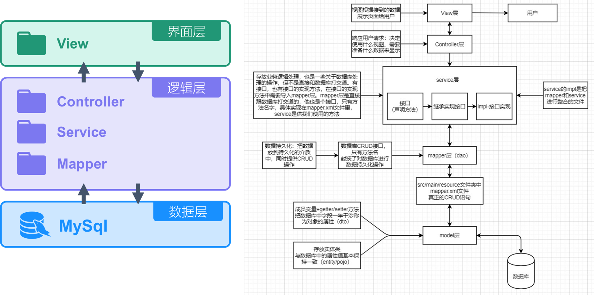
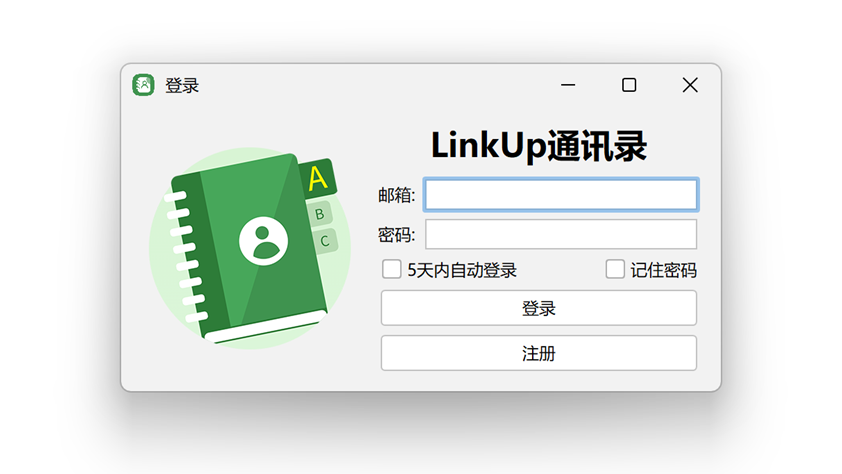
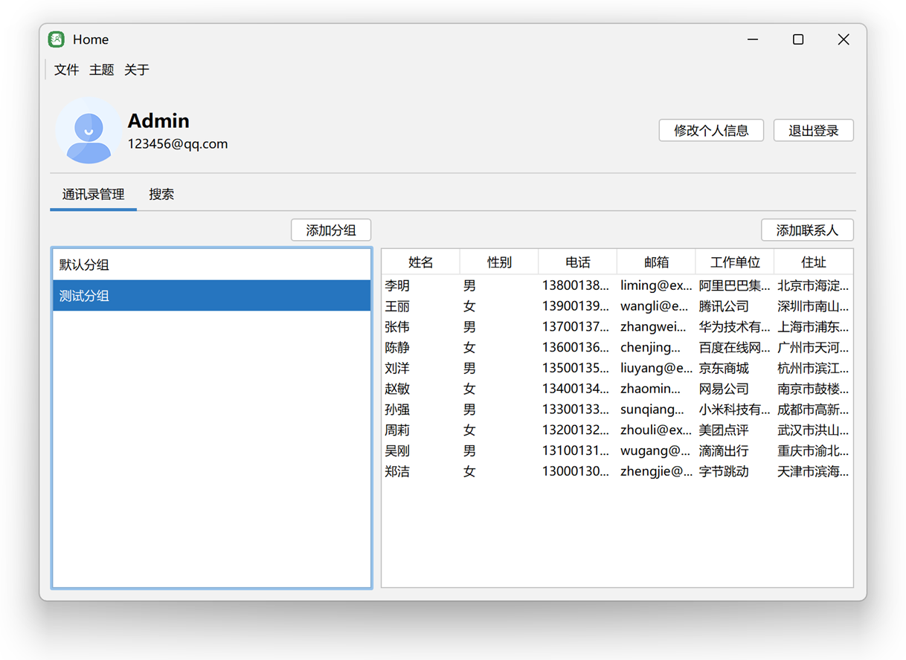
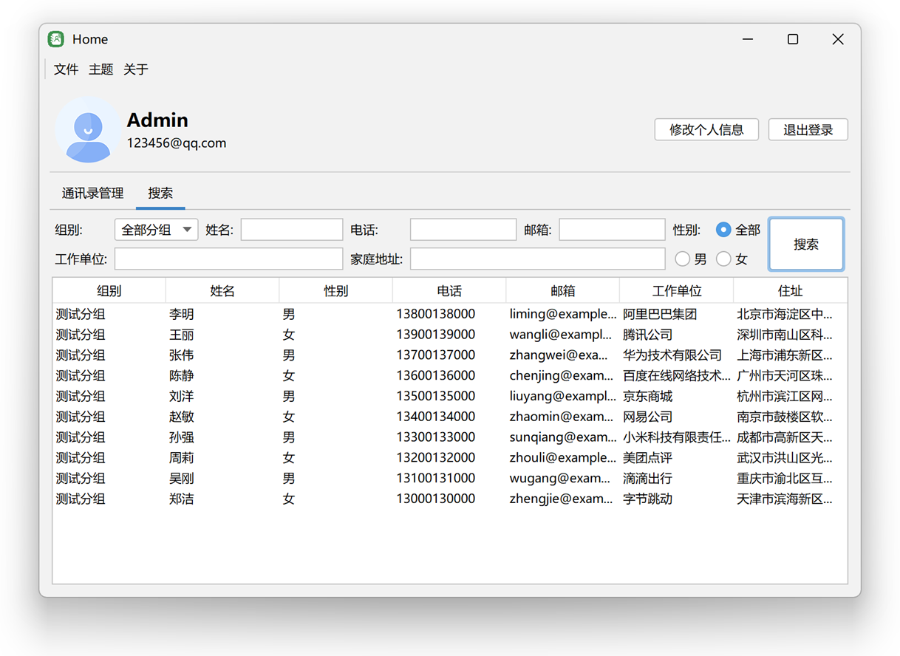
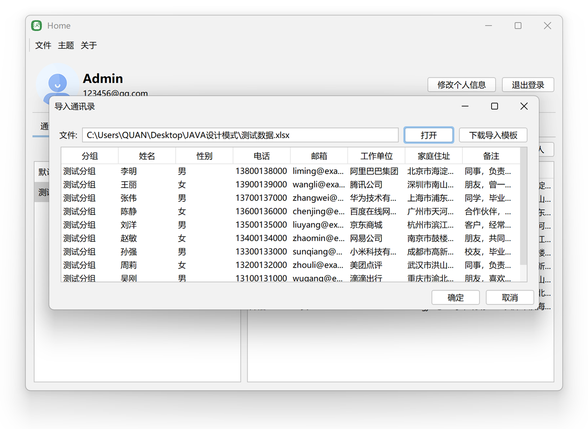

<h2>LinkUp通讯录</h2>

丽水学院2024学年第二学期JAVA设计模式期末大作业

<a href="#📋概述">概述</a> &nbsp;&bull;&nbsp;
<a href="#💡系统功能">系统功能</a> &nbsp;&bull;&nbsp;
<a href="#🗂️架构设计">架构设计</a> &nbsp;&bull;&nbsp;
<a href="#💻UI设计">UI设计</a> &nbsp;&bull;&nbsp;
<a href="#📊运行环境">运行环境</a> 

## 📋概述

​	LinkUp 通讯录是一款专为现代用户设计的高效、智能的通讯录管理工具。它不仅帮助您轻松管理和组织联系人信息，还提供了便捷的分组管理、多功能查询和数据导入导出等功能，确保您可以随时随地访问和更新重要联系。

​	该项目为JAVA设计模式项目期末作业，在架构上借鉴了Spring的三层架构设计，融入了单例、备忘录、策略、观察者、外观、责任链共6种模式，使得项目的可拓展性和可维护性得到了极大的提高。

## 💡系统功能

## 🗂️架构设计

## 💻UI设计

|  |  |  |  |
| :----------------------------------------------------------: | :----------------------------------------------------------: | :----------------------------------------------------------: | :----------------------------------------------------------: |
|                             登录                             |                             首页                             |                             搜索                             |                             导入                             |

## 📊运行环境

- JAVA 1.8.0_392
- Maven 3.6.1
- MySql 8.0.36

> SQL语句address_book.sql为仅数据库结构版本，address_book_with_data.sql为包含数据版本(测试帐号邮箱为123456@qq.com，密码为admin123)